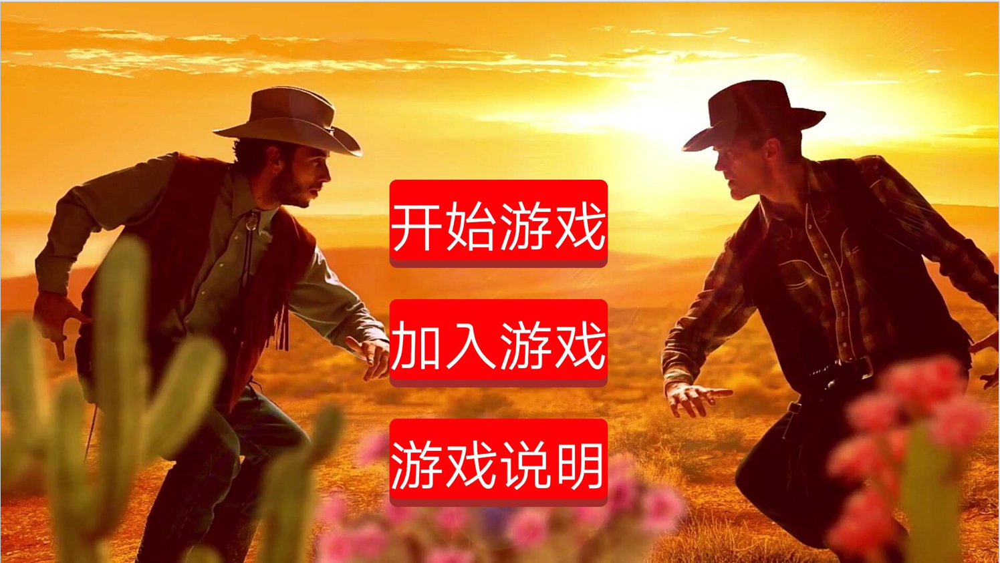
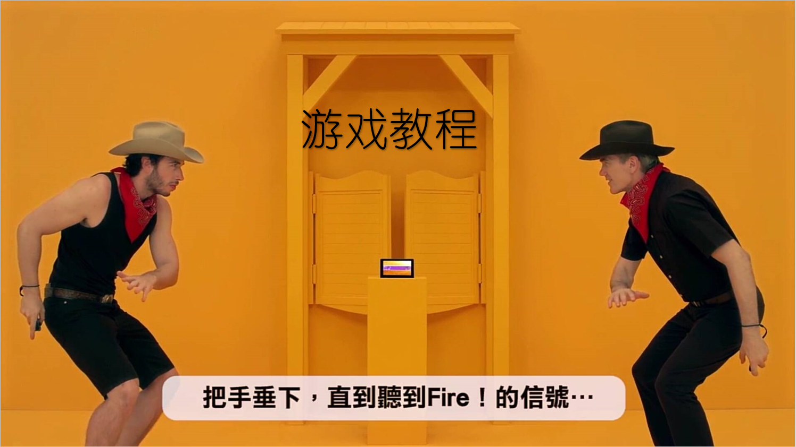
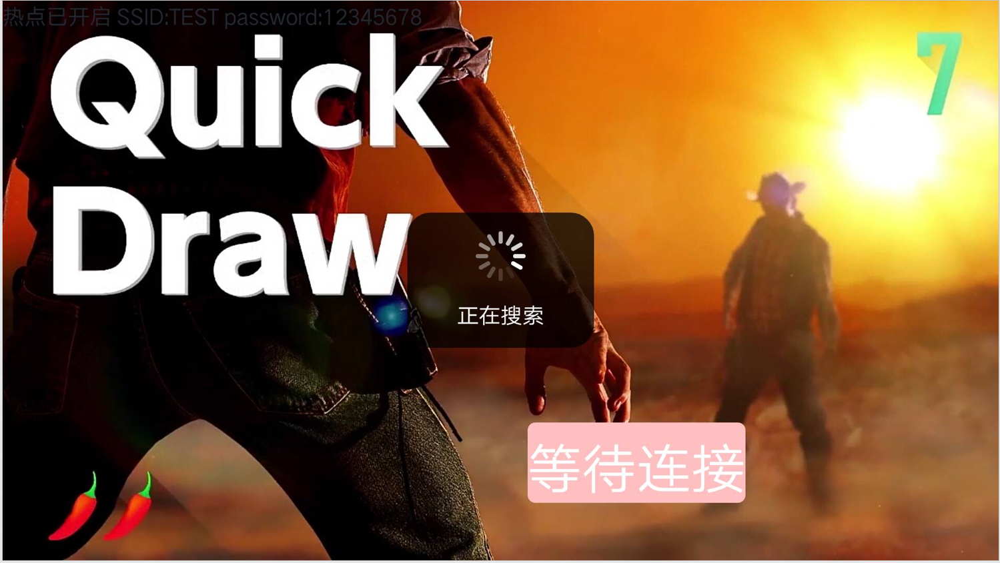
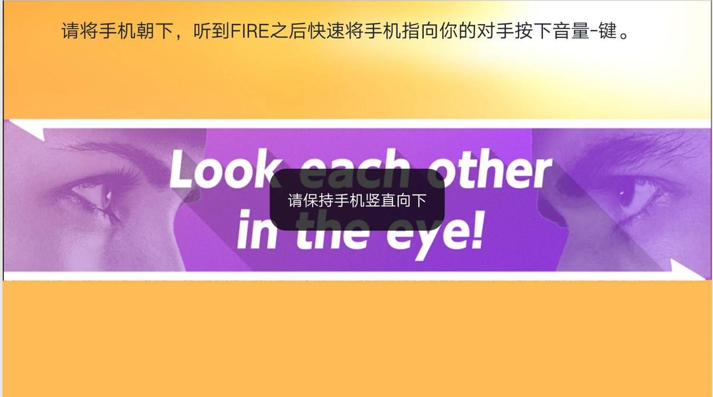
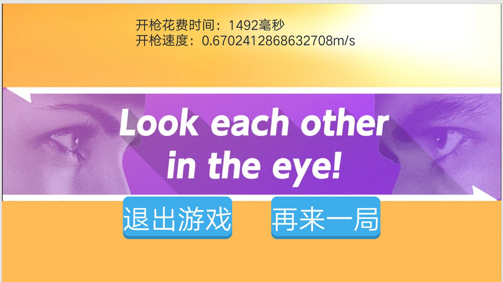

# quick-draw-Android 快枪手安卓版

移植于任天堂 Switch 平台 1/2switch 中的快枪手游戏，本游戏中的图片、音频、视频素材均源于此。在原作中手柄被虚拟成手枪，而这里我们将手机虚拟为手枪。

## 游戏说明

Quick Draw 快枪手是一款安卓体感游戏 app，这个游戏模拟了美国西部牛仔决斗的场景，需要在最短时间内完成“拔枪——对准——开火”的步骤，考验了玩家的反应速度，适合在家庭聚会、朋友聚会时游玩。

该游戏是双人联机游戏，正式游玩之前需要通过游戏内设置进行联机。游戏时玩家面对面站立，手持手机竖直向下，等待游戏宣告发射指令，当手机发出“fire”指令时， 最快的将手机对准正前方并按下按键，率先击中对手的玩家胜出。

### Features

- [x] 👫本地双人对战
- [x] 📱网络自动匹配
- [x] 💾预防用户误操作
- [x] 🎉游戏数据显示
- [x] 👌针对网络的版本适配
- [ ] 动作动画还原
- [ ] 多种开枪模式

## 游戏截图

主界面：

游戏教程：

匹配界面：

准备界面：

结算界面：

## LICENSE

>    Copyright 2019 getianao
>
>    Licensed under the Apache License, Version 2.0 (the "License");
>    you may not use this file except in compliance with the License.
>    You may obtain a copy of the License at
>
>    http://www.apache.org/licenses/LICENSE-2.0
>
>    Unless required by applicable law or agreed to in writing, software
>    distributed under the License is distributed on an "AS IS" BASIS,
>    WITHOUT WARRANTIES OR CONDITIONS OF ANY KIND, either express or implied.
>    See the License for the specific language governing permissions and
>    limitations under the License.